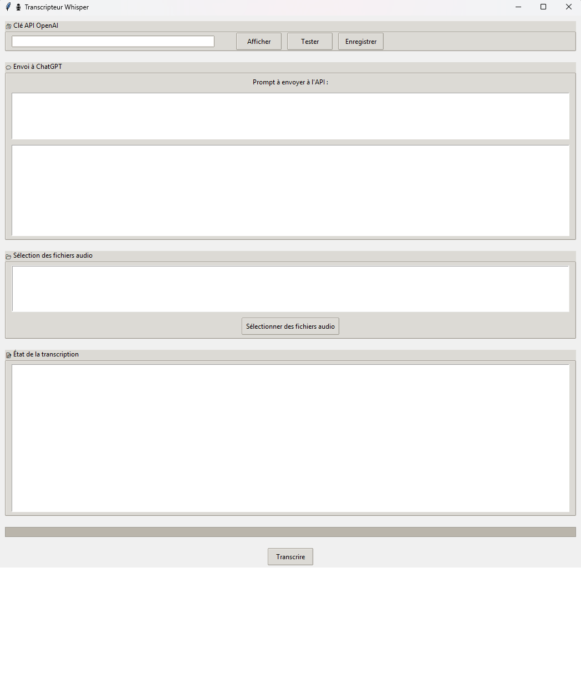

# Transcripteur Whisper 🎙️

Application de transcription audio avec Whisper et interface graphique Tkinter.  
Elle permet également d'envoyer le texte transcrit à l'API OpenAI (ChatGPT) pour enrichissement ou résumé.

## Fonctionnalités
- Transcription de fichiers audio (.wav, .mp3, .m4a, .flac)
- Option de découpage de long fichiers audio en segments
- Utilisation GPU (CUDA) si disponible
- Interface Tkinter simple et claire
- Envoi à l'API OpenAI (GPT-3.5-turbo)
- Enregistrement automatique des préférences utilisateur

## Ecran


## Prérequis

- Python ≥ 3.9
- Une clé API OpenAI : https://platform.openai.com/account/api-keys

## Installation

```bash
pip install -r requirements.txt
```

## Utilisation

```bash
python main.py
```

## Configuration

Crée un fichier `.env` à la racine avec :

```env
OPENAI_API_KEY=sk-xxxxxxxxxxxxxxxxxxxxxxxxxxxxxxxxxxxxxxxx
```

---

## Fichiers

- `main.py` : point d'entrée de l'application
- `gui.py` : interface utilisateur
- `openai_chat.py` : interaction avec l'API OpenAI
- `whisper_engine.py` : transcription audio via Whisper
- `config.py` : sauvegarde des préférences
- `utils.py` : fonctions utilitaires

## Licence

MIT
